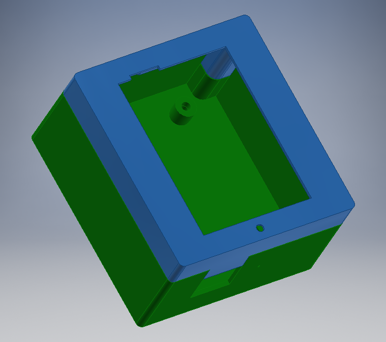
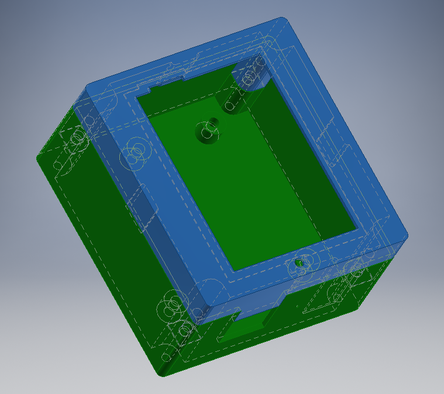
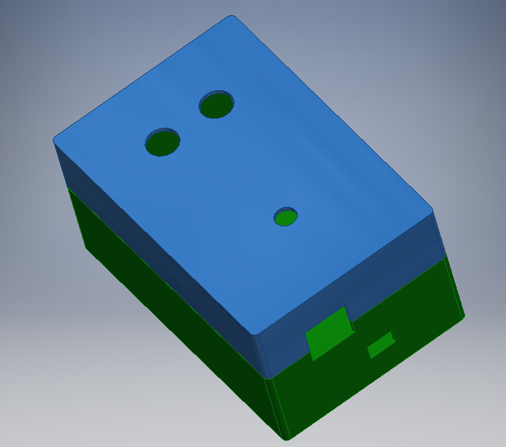
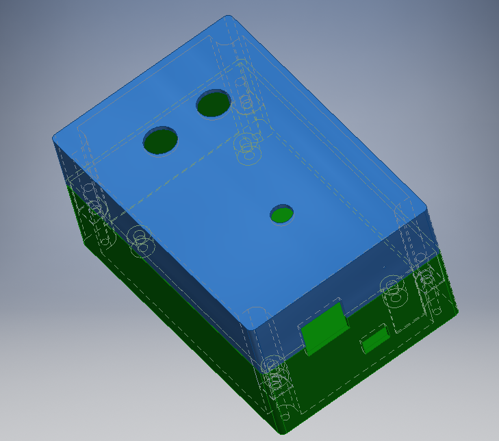

# BP_PROJ

### piskvorky_MP_v1 
- Piškvorky pro až 5 hráčů
- 1x arduino Due jako server, max 5x arduino Ethernet s dotykovým displejem jako client
- připojovánou přes router s DHCP (serveru nutno přidělit pevnou IP)
- aktualizovaný návod na ovládání [zde](https://github.com/janzavorka/BP_PROJ/blob/master/piskvorky_MP_v1/manual.md)
---

### Piskvorky_red
- Původní verze verze hry pouze pro dva hráče
- HW: 2x Arduino Ethernet, 2x 2,4" dotykový display
- jedno arduino jako server, druhé jako client (pevná IP adresa)
---

### Knihovny
- Knihovny použité pro ovládání (nemusí být aktuální verze)
- Domovské stránky knihoven:
    - [SimpleTimer](https://github.com/schinken/SimpleTimer)
    - Pro ovládání displeje:
        - [MCUFRIEND_kbv](https://github.com/prenticedavid/MCUFRIEND_kbv)
        - [Adafruit_TouchScreen](https://github.com/adafruit/Adafruit_TouchScreen)
---

### Menu 
- Návrh původního menu pro piškvorky 
---

### piskvorky_case
- Návrh krabiček pro jednotlivá zařízení ([Autodesk Inventor Professional 2019 Student Edition](https://www.autodesk.cz/products/inventor/overview))
- Realizace pomocí 3D tisku

|   |
|:---------:|
|Krabička pro clienta (Arduino Ethernet s 2,4" displejem)|

|   |
|:---------:|
|Krabička pro server (Arduino Due s Ethernet modulem + tlačítka a signalizační LED)|

 ---
 
### piskvorky_MP_old
- Starší funkční verze projektu
---

### Zprava_BPROJ
-  Výstupní zpráva z celého projektu pro předmět B2BPROJ4
---

### RGB_LED_cal
- Slouží ke kalibraci barev pro RGB LED u serveru (Arduino Due)
- RGB LED připojení:
    - R -> D6
    - G -> D7
    - B -> D8
- RGB LED se připojí na příslušné PWM piny, změna barev a celkové intenzity probíhá pomocí sériového monitoru
- Příkaz _"help"_ vypíše nápovědu přímo na sériový monitor
- Příkaz: _"led rrr,ggg,bbb,inten"_, kde:
    - _rrr,ggg,bbb_ jsou voleny z <0;&nbsp;255> a reprezentují jednotlivé barvy
    - _inten_ je volena z <0;&nbsp;100> a reprezentuje celkovou intenzitu LED
 ---
 
 ### Notes.md
 - Několik zjištění a postřehů z tvorby tohoto projektu
