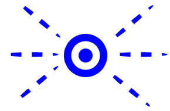
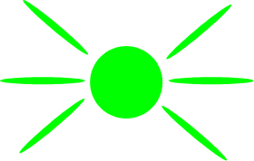
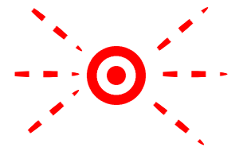

# Návod na použití piškvorek

### Význam indikační LED u serveru
Význam:  svítí,  bliká

| Stav                                                                        | Význam        |
| :------------------------------------------------------------------------:  |:-------------:|
|                    | server je vypnutý/nemá napájení |
|                   | server je připraven             |  
|    3x      | nový client připojen            |
|    3x      | client se odpojil/byl odpojen   |
|                    | aktuálně běží hra               |
|              | hra ukončena (výhra/remíza)     |
|        3x      | chyba (nedostatek hráčů pro hru)|
|      stále     | chyba sítě (připojení kabelu)   |

---

### Funkce tlačítek na serveru
####  `Zelené tlačítko`:
  - Pokud neběží hra (indikační LED svítí modře ) - stiskem tlačítka dojde ke spuštění hry (s ověřením zda je k dispozici dostatek hráčů)
  - Pokud hra již běží (indikační LED svítí zeleně ) - stiskem tlačítka dojde k posunutí tahu na dalšího hráče

####  `Červené tlačítko`:
  - Pokud je stisknuto, dojde k přerušení hry aktuálně běžící hry (dosavadní stav hry je resetován)
---

### Příkazy pro server
|  Příkaz |                         Význam                         |
|:-------:|:------------------------------------------------------:|
|   help  | Vypíše nápovědu (dostupné příkazy)                     |
|   info  | Vypiší informace o serveru (HW, verze SW, apod.)       |
| players | Zobrazí čísla a IP adresy připojených hracu            |
| kick 'x'| Odpojí hráče číslo _x_                                 |
| nextP   | Přepne na dalšího hráče                                |
|  start  | Spustí hru (ekvivalent zeleného tlačítka)              |
|  reset  | Přeruší a resetuje hru (ekvivalent červeného tlačítka) |
